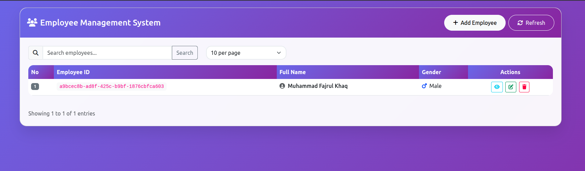

# Employee Management REST API

REST API sederhana untuk operasi CRUD (Create, Read, Update, Delete) pada data Employee menggunakan Spring Boot.

## Technical Requirements

- **Framework**: Spring Boot (v3.x)
- **Frontend**: Thymeleaf for server-side rendering of the user interface
- **ORM**: JPA (Hibernate) for object-relational mapping
- **Architecture**: Implements the MVC (Model-View-Controller) pattern
- **Database**: PostgreSQL as the relational database
- **Unit Testing**: JUnit and Mockito for unit testing
- **REST Documentation**: Swagger (OpenAPI) for API documentation
- **Exception Handling**: Centralized error handling with standard response format
- **Table Display**: DataTables for interactive table display in the user interface
- **Java Version**: Java 17 or higher
- **Build Tool**: Maven for dependency management and build


## How to Run

### 1. Clone Repository
```bash
git clone <repository-url>
cd crud-employee
```

### 2. Database Configuration
```properties
# Database Configuration
spring.datasource.url=jdbc:postgresql://${DB_HOST:localhost}:${DB_PORT:5432}/${DB_NAME:crud_db}
spring.datasource.username=${DB_USER:}
spring.datasource.password=${DB_PASSWORD:}
spring.datasource.driver-class-name=org.postgresql.Driver

# JPA Configuration
spring.jpa.hibernate.ddl-auto=update
spring.jpa.show-sql=true
spring.jpa.properties.hibernate.dialect=org.hibernate.dialect.PostgreSQLDialect

# Server Configuration
server.port=8080
```

### 3. Run Application
```bash
  Run file FajrulApplicationTests
```

Aplikasi akan berjalan di: `http://localhost:8080`

## API Documentation

### Swagger UI
Akses dokumentasi API lengkap di: **http://localhost:8080/swagger-ui/index.html**

### User Interface
Akses user interface di : **http://localhost:8080/employees**

### API Endpoints

| Method | Endpoint | Description |
|--------|----------|-------------|
| GET | `/api/v1/employee` | Get all employees with pagination |
| GET | `/api/v1/employee/{id}` | Get employee by ID |
| POST | `/api/v1/employee` | Create new employee |
| PUT | `/api/v1/employee` | Update employee |
| DELETE | `/api/v1/employee/{id}` | Delete employee |

### Sample Request/Response

#### Create Employee
```http
POST /api/v1/employee
Content-Type: application/json

{
  "firstName": "John",
  "lastName": "Doe", 
  "birthDate": "1990-05-15",
  "gender": "M",
  "hireDate": "2024-01-15"
}
```

#### Response
```json
{
  "statusCode": 201,
  "message": "Employee created successfully",
  "data": {
    "id": "550e8400-e29b-41d4-a716-446655440000",
    "firstName": "John",
    "lastName": "Doe",
    "birthDate": "1990-05-15", 
    "gender": "M",
    "hireDate": "2024-01-15"
  }
}
```

#### Get All Employees (with Pagination)
```http
GET /api/v1/employee?page=1&size=10&sort=firstName&direction=asc&search=John
```

#### Response
```json
{
  "statusCode": 200,
  "message": "Employee retrieved successfully",
  "data": [
    {
      "id": "550e8400-e29b-41d4-a716-446655440000",
      "firstName": "John",
      "lastName": "Doe",
      "birthDate": "1990-05-15",
      "gender": "M", 
      "hireDate": "2024-01-15"
    }
  ],
  "paging": {
    "totalPages": 1,
    "totalElements": 1,
    "page": 1,
    "size": 10,
    "hasNext": false,
    "hasPrevious": false
  }
}
```

### Test Coverage
Test coverage report akan tersedia di: `test/java/crud_fajrul/service/EmployeeServiceImplTest`

### Gender Enum
- `M` - Male
- `F` - Female

## Error Handling

API menggunakan standard HTTP status codes:

- `200` - OK
- `201` - Created
- `400` - Bad Request
- `404` - Not Found
- `500` - Internal Server Error

Error response format:
```json
{
  "timestamp": "2024-01-15T10:30:00",
  "status": 400,
  "error": "Bad Request",
  "message": "Validation failed",
  "path": "/api/employees"
}
```

## Screenshots

### Swagger Documentation


### User Interface



## Video Presentasi

Watch the project presentation video here:  
[Video Presentasi](https://jam.dev/c/b7c0ee30-2ea1-4ca7-ab89-f77f4f5cacf7)